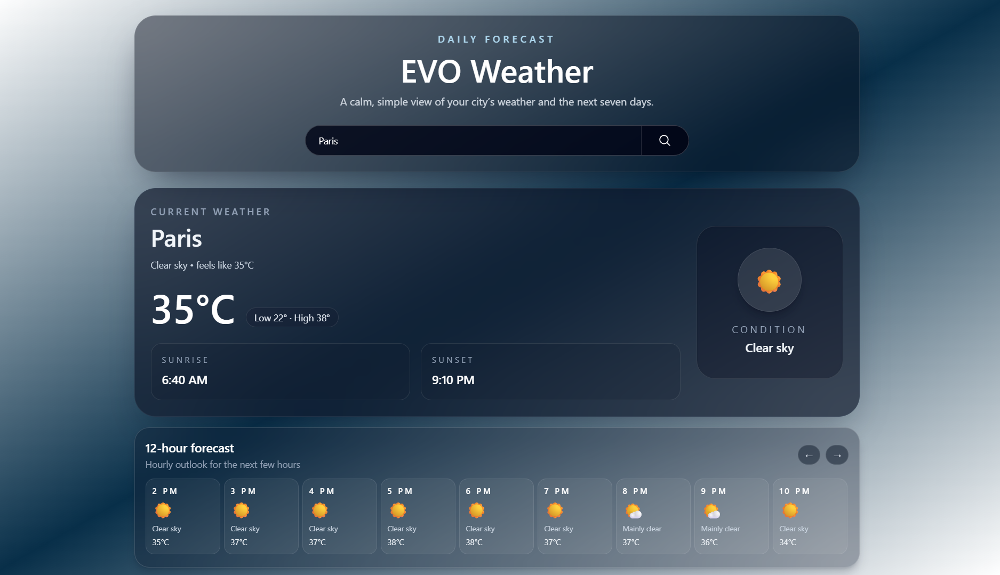
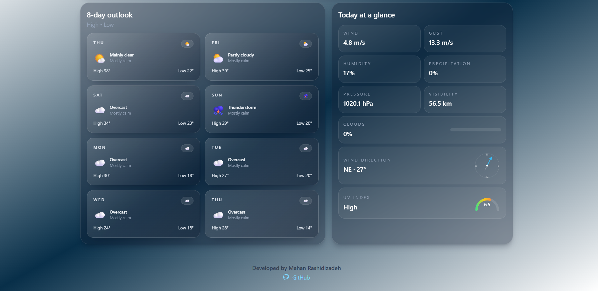

# EVO Weather

A weather forecasting application built with Django and Open-Meteo API.

The project provides real-time weather information by consuming external APIs and demonstrates backend integration, asynchronous requests, caching, Docker containerization, PostgreSQL, and Redis.

---

## Features

- Search weather by city
- Current weather information
- Hourly weather forecast
- Daily weather forecast
- AJAX requests (without page reload)
- PostgreSQL integration
- Redis caching
- Dockerized application
- Responsive interface

---

## Tech Stack

- Python
- Django
- PostgreSQL
- Redis
- Docker
- Docker Compose
- HTML
- CSS
- JavaScript
- Tailwind CSS
- Open-Meteo API

---

## Screenshots

### Home




---

## Project Structure

```text
│
├── weather/
│   ├── models.py
│   ├── serializers.py
│   ├── services.py
│   ├── utils.py
│   ├── views.py
│   └── templates/
│
├── weather_project/
│   ├── settings.py
│   ├── urls.py
│   ├── wsgi.py
│   └── asgi.py
│
├── manage.py
├── requirements.txt
├── .env
├── .gitignore
├── Dockerfile
├── .Dockerignore
├── build.sh
```

---

## Installation

Clone repository

```bash
git clone https://github.com/Mahan-Rz/EVO-Weather.git
```

Go to project

```bash
cd EVO-Weather
```

Create virtual environment

```bash
python -m venv .venv
```

Activate environment

Windows

```bash
.venv\Scripts\activate
```

Linux / macOS

```bash
source .venv/bin/activate
```

Install dependencies

```bash
pip install -r requirements.txt
```

---

## Environment Variables

Create a `.env` file.

```env
SECRET_KEY=your_secret_key
DEBUG=True

DB_NAME=...
DB_USER=...
DB_PASSWORD=...
DB_HOST=localhost
DB_PORT=5432

REDIS_HOST=localhost
REDIS_PORT=6379
```

---

## Run with Docker

```bash
docker compose up --build
```

Application:

```
http://localhost:8000
```

---

## What I Learned

During this project I practiced:

- Integrating third-party APIs
- Working with JSON responses
- AJAX requests using JavaScript
- PostgreSQL integration
- Redis caching
- Docker & Docker Compose
- Environment variables
- Debugging deployment issues

---

## Future Improvements

- User authentication
- Favorite cities
- Weather alerts
- Historical weather
- Production deployment
